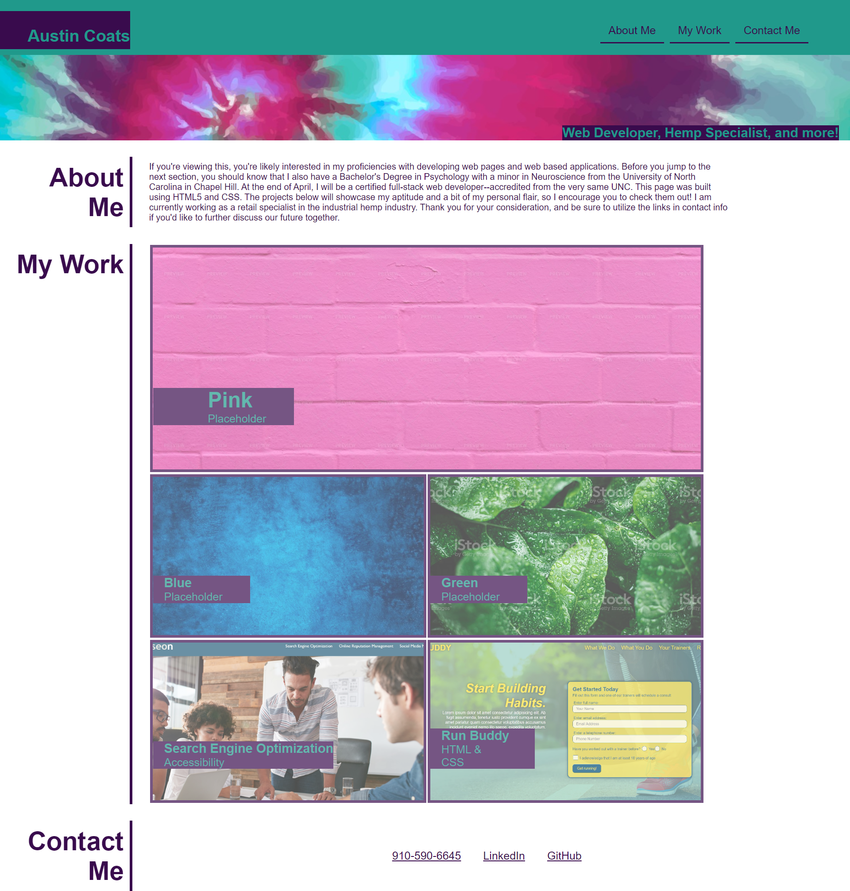

# Austin's Portfolio

## Purpose 
This site was made in order to showcase my personal and professional projects in a way that is both organized and appealing to the eye. Each project image on the page is a clickable link that will take the user to a deployed project or placeholder. Nav links in the header are also available for expedient navigation to any section of the page. Contact info is at the bottom of the page and includes various ways to contact me or view more of my work. 

## Key Features
- Nav links
- Project links
- 'About Me' section
- Contact Info
- CSS Media Queries
- Personal flair!

### Built Using
This page was built with HTML and CSS. 

### Deployed Site
Site is hosted on GitHub Pages and deployed at [portfolio-challenge](https://aucoats.github.io/portfolio-challenge).

### Screenshot
